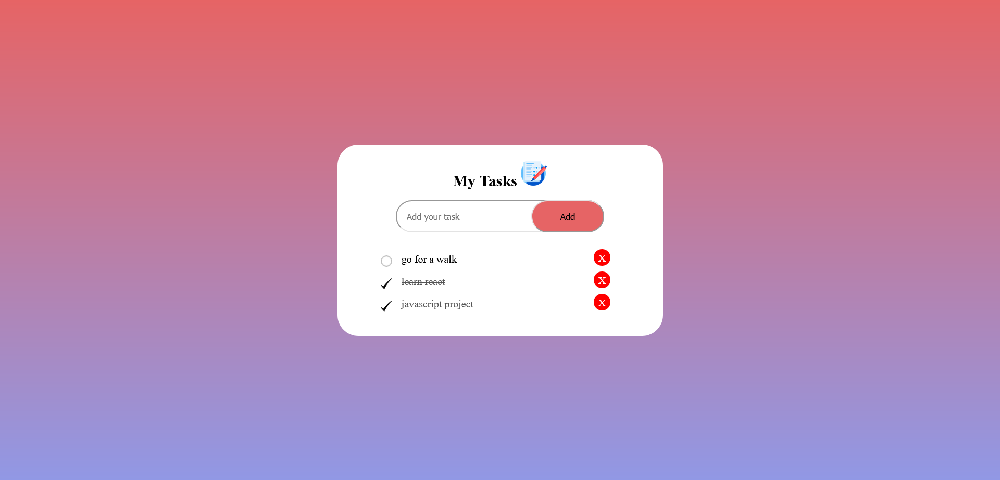

#Task List

## Table of contents

- [Overview](#overview)
  - [The challenge](#the-challenge)
  - [Links](#links)
- [My process](#my-process)
  - [Built with](#built-with)
  - [What I learned](#what-i-learned)
  - [Continued development](#continued-development)
  - [Useful resources](#useful-resources)
- [Author](#author)

## Overview

### The challenge
I wanted to a list to organize my work routine for every day. 

### Links

- Solution URL: (https://github.com/stathislag/tasklist)
- Live Site URL: (https://stathislag.github.io/tasklist/)

## My process

### Built with

- HTML5 
- CSS 
- Flexbox
- Media Queries
- Javascript

### What I learned

Some of my major learnings while working through this project. My project structured with Html, Css, Javascript. New consepts  is how to write Vanilla Javascript
concepts like functions, add classes and give functionality.

### Continued development

In future projects i would like to learn more consepts about Javascript Framework like React and try out new techniques with Javascript.

### Useful resources
This helped me with the building process and answered all my questions:
- [Resource 1](https://developer.mozilla.org/).
- [Resource 2](https://www.w3schools.com/).
- [Resource 3](https://www.youtube.com).
- [Resource 4](https://www.stackoverflow.com).
- [Resource 5](https://www.freecodecamp.org).

## Author

- Website - [Stathis](https://github.com/stathislag)

